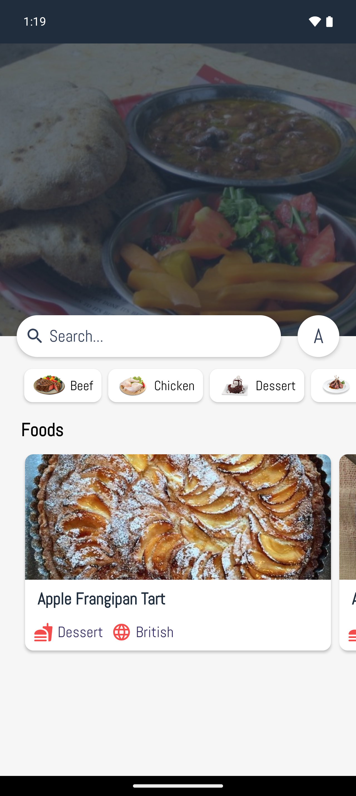
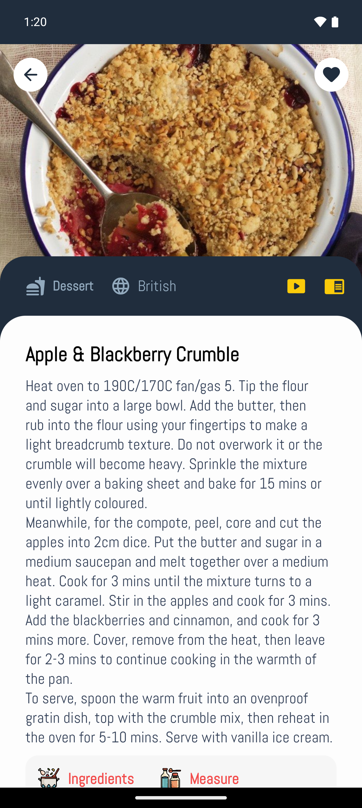
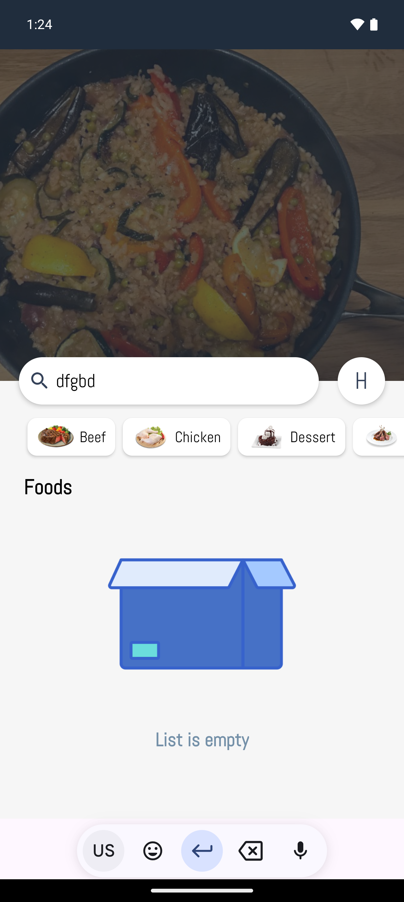
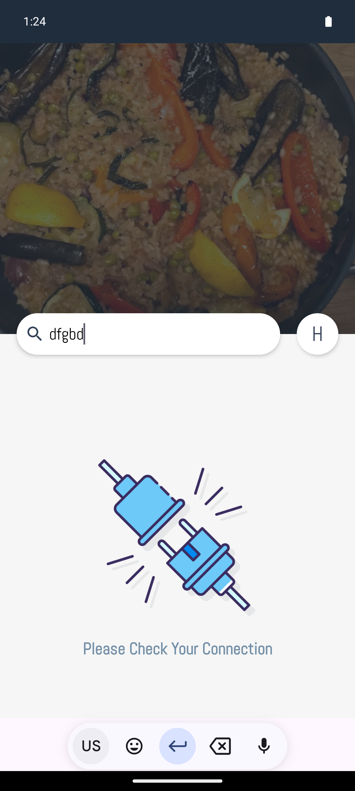

# Food App With Kotlin
Food App using the API from https://www.themealdb.com

The technologies used in this project consist of:

1.Kotlin

2.Xml

3.Hilt

4.RxJava 

5.Retrofit

6.MVP

# Screenshot

 

 
